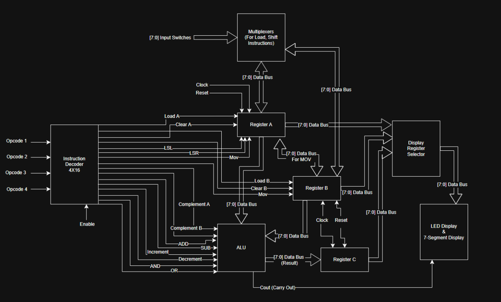
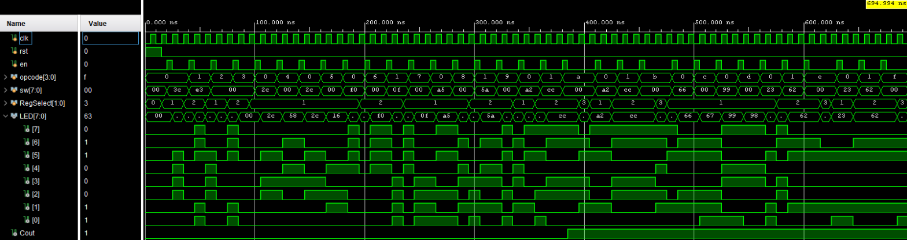

# Custom 8-Bit Microprocessor

A single-cycle, memoryless 8-bit microprocessor implemented in Verilog HDL and deployed onto a Xilinx Basys 3 FPGA. This architecture features a custom 4-bit opcode instruction set capable of executing 16 arithmetic, logical, and register manipulation operations.

## Features
* Single-cycle architecture
* Custom 4-bit instruction set
* 16 ALU operations
* Three 8-bit general-purpose registers
* FPGA implementation on Basys 3 FPGA
* Behavioral simulation testbench

## Instruction Set

The processor implements a custom 4-bit instruction set supporting 16 data movement, arithmetic, logical, shift, and register manipulation operations. Each opcode is decoded into one-hot control signals by a 4×16 instruction decoder.

| Opcode | Operation | Description |
|:------:|-----------|-------------|
| 0000 | Load A | Loads value into RegA |
| 0001 | Load B | Loads value into RegB |
| 0010 | Clear A | Clears RegA |
| 0011 | Clear B | Clears RegB |
| 0100 | LSL A | Logical shift left RegA |
| 0101 | LSR A | Logical shift right RegA |
| 0110 | MOV A → B | Move RegA to RegB |
| 0111 | MOV B → A | Move RegB to RegA |
| 1000 | Complement A | Complement RegA |
| 1001 | Complement B | Complement RegB |
| 1010 | ADD | RegC ← RegA + RegB |
| 1011 | SUB | RegC ← RegA − RegB |
| 1100 | Increment A | Increment RegA |
| 1101 | Decrement A | Decrement RegA |
| 1110 | AND | RegC ← RegA AND RegB |
| 1111 | OR | RegC ← RegA OR RegB |

*Table 1: Opcodes and their Operations*

## System Architecture
* **Instruction Decoder:** A $4\times16$ decoder that translates 4-bit opcodes into one-hot control signals.
* **Registers:** Three synchronous 8-bit registers (RegA, RegB, RegC) for operand storage and computation results.
* **ALU:** Executes 16 unique operations including addition (with `Cout`), subtraction, logical shifts (`LSL`/`LSR`), increments, decrements, and bitwise logic (`AND`/`OR`).
* **Hardware I/O:** Features a 10ms hardware debounce module for single-cycle execution via pushbuttons, physical slide-switch data entry, and multiplexed 7-segment display tracking.


*Figure 1: Block Diagram of Microprocessor*

## Tools
* **Language:** Verilog HDL
* **Toolchain:** Xilinx Vivado 
* **Target Hardware:** Basys 3 FPGA (Artix-7)

## Verification & Simulation
Functional verification was performed using behavioral Verilog testbenches to validate the complete instruction set execution flow. 
* *Simulation Tip:* To expedite testbench behavioral verification, the physical 10ms debounce logic counter was bypassed to allow fluid continuous-enable execution tracking via the Vivado Tcl Console.


*Figure 2: Waveform of simulation*

### Tcl Console Output Log
```text
PASS: LOAD A
PASS: LOAD B
PASS: CLR A
PASS: CLR B
PASS: LSL A
PASS: LSR A
PASS: MOV A->B
PASS: MOV B->A
PASS: Complement A
PASS: Complement B
PASS: ADD
PASS: SUB
PASS: Increment A
PASS: Decrement A
PASS: AND
PASS: OR

Test Completed
```

## How to Run
1. Clone this repository.
2. Open Xilinx Vivado and create a new project targeting the **Basys 3 board**.
3. Import all files from the `src/`, `sim/`, and `constraints/` directories.
4. Run Behavioral Simulation to view waveforms, or Run Synthesis & Implementation to generate the bitstream and program the physical FPGA hardware.

## Documentation
The complete design methodology, architecture, verification, and FPGA implementation are documented here.
- [Final Design Report](Final_Project.pdf)
